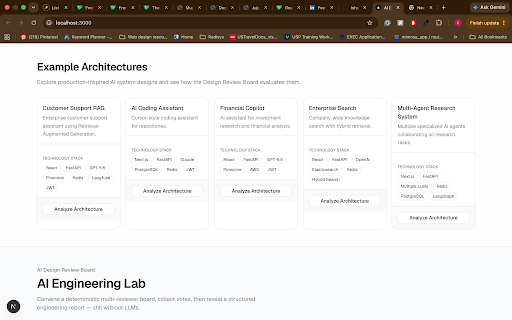
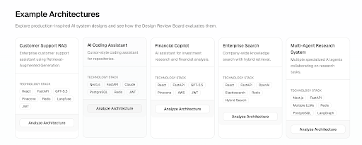

# ✈️ PreFlight AI

> **Review AI systems before they reach production.**

PreFlight AI is a production-focused AI engineering review platform that analyzes AI system architectures before they are deployed.

Instead of asking a generic LLM for feedback, PreFlight AI simulates a **Design Review Board**, where specialized reviewers evaluate an AI system across engineering dimensions such as:

- 📈 Scalability
- 🔒 Security
- 👀 Observability
- ⚙️ Reliability
- 💰 Cost

The goal is simple:

> Catch architectural issues **before** they become production incidents.

---

# 📸 Preview

> Replace these with your actual images.



---

# 🚀 Why I Built This

While building production AI systems, I noticed something interesting.

Most architecture reviews happen:

- after development
- during code review
- or even worse... after deployment

I wanted to explore a different idea.

**What if an AI system could perform a structured architecture review before a single line of production code is written?**

PreFlight AI is my attempt at answering that question.

---

# ✨ Current Features (v1.0)

✅ Interactive Design Review Board

✅ Production-style engineering report

✅ Rule-based engineering reviewers

✅ Example AI architectures

✅ Executive dashboard

✅ Engineering recommendations

✅ Professional review workflow

---

# 🎬 How It Works

1. Choose an example architecture (or fill out your own)

2. Convene the Design Review Board

3. Specialized reviewers evaluate the architecture

4. Reviewers vote

5. Receive an executive engineering report

---

# 📷 Screenshots

## Example Architectures



---

## Design Review Board


---

## Executive Report


---

## Detailed Engineering Review


---

# 🏗 Architecture

```
                    User

                      │

                      ▼

          Next.js Frontend

                      │

                      ▼

            FastAPI Backend

                      │

                      ▼

        Design Review Service

                      │

     ┌────────────────────────────────┐
     │                                │
     ▼                                ▼

Scalability Reviewer        Security Reviewer

Observability Reviewer      Reliability Reviewer

Cost Reviewer

                      │

                      ▼

            Review Board Decision

                      │

                      ▼

         Engineering Report
```

---

# ⚙️ Tech Stack

## Frontend

- Next.js
- TypeScript
- Tailwind CSS
- shadcn/ui

## Backend

- FastAPI
- Python 3.12
- Pydantic

## Architecture

- Clean Architecture
- Service Layer Pattern
- Strategy Pattern (Reviewers)

---

# 🤔 Why Not Just Use ChatGPT?

That's a fair question.

ChatGPT can certainly review an architecture if you paste it into a prompt.

PreFlight AI focuses on something different.

| ChatGPT | PreFlight AI |
|----------|--------------|
| Generic conversation | Structured engineering workflow |
| One response | Multiple specialized reviewers |
| Free-form output | Executive engineering report |
| No review process | Simulated Design Review Board |
| Prompt dependent | Consistent evaluation workflow |

Future versions will also include:

- LLM reviewers
- Architecture knowledge base
- GitHub repository review
- Prompt review
- RAG review

---

# 🗺 Roadmap

## ✅ Version 1.0

- [x] Rule-based reviewers
- [x] Review Board
- [x] Executive report
- [x] Example architectures
- [x] Responsive UI

---

## 🚧 Version 2.0

- [ ] LLM-powered reviewers
- [ ] Multi-agent review workflow
- [ ] Confidence scoring
- [ ] Architecture knowledge base

---

## 🚀 Version 3.0

- [ ] Mermaid diagram upload
- [ ] Repository analysis
- [ ] Prompt review
- [ ] RAG review
- [ ] Agent workflow review

---

# 🛠 Running Locally

## Backend

```bash
cd backend

python -m venv .venv

source .venv/bin/activate

pip install -r requirements.txt

uvicorn app.main:app --reload
```

## Frontend

```bash
cd frontend

npm install

npm run dev
```

---

# 📂 Repository Structure

```
backend/
    api/
    services/
    reviewers/
    schemas/
    prompts/

frontend/
    app/
    components/
    lib/
    services/
    types/
```

---

# 🎯 Vision

PreFlight AI is the first module of a broader AI Engineering platform.

Future modules will review:

- AI Architectures
- Prompt Engineering
- RAG Systems
- AI Agents
- GitHub Repositories
- Production Readiness

The long-term vision is to build an engineering copilot that helps teams design better AI systems before they reach production.

---

# 👨‍💻 Author

**Ishan Bansal**

AI / ML Engineer

Building production AI systems with LLMs, RAG, NLP, and AI Agents.

If this project interests you, feel free to connect or contribute.

---

# ⭐ Support

If you found this project interesting, consider giving it a ⭐.

It helps others discover the project and motivates future development.
